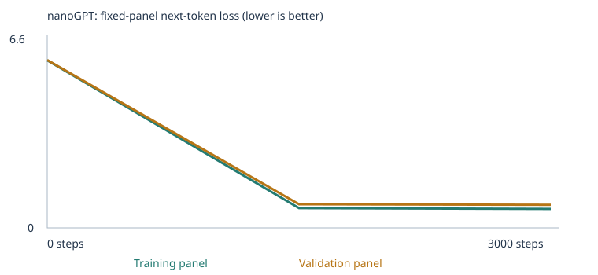
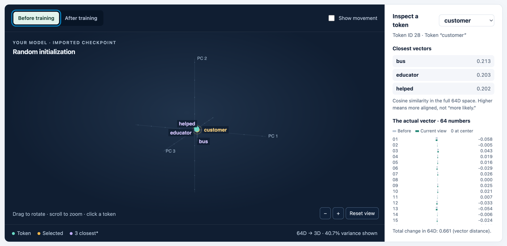
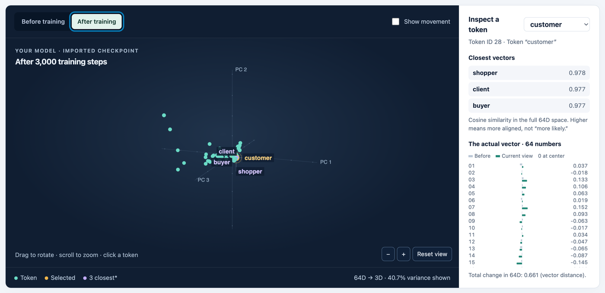
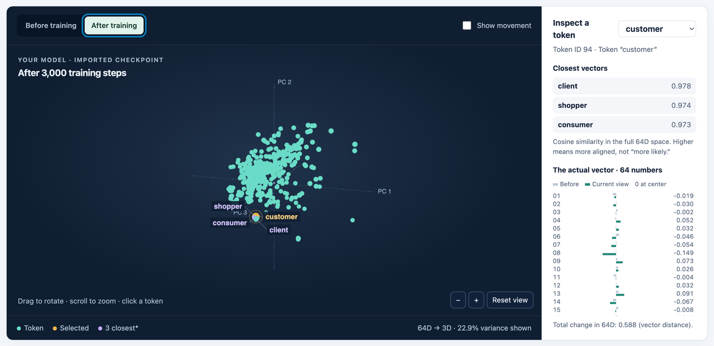
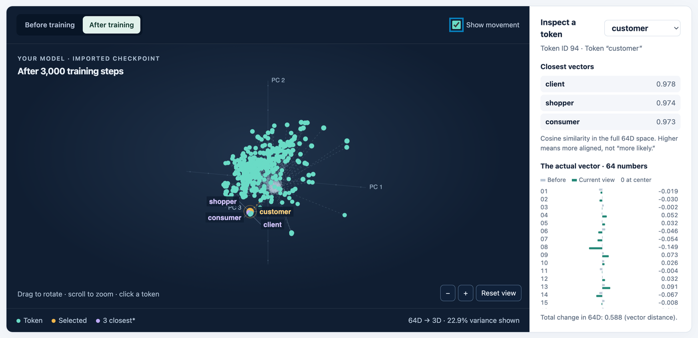
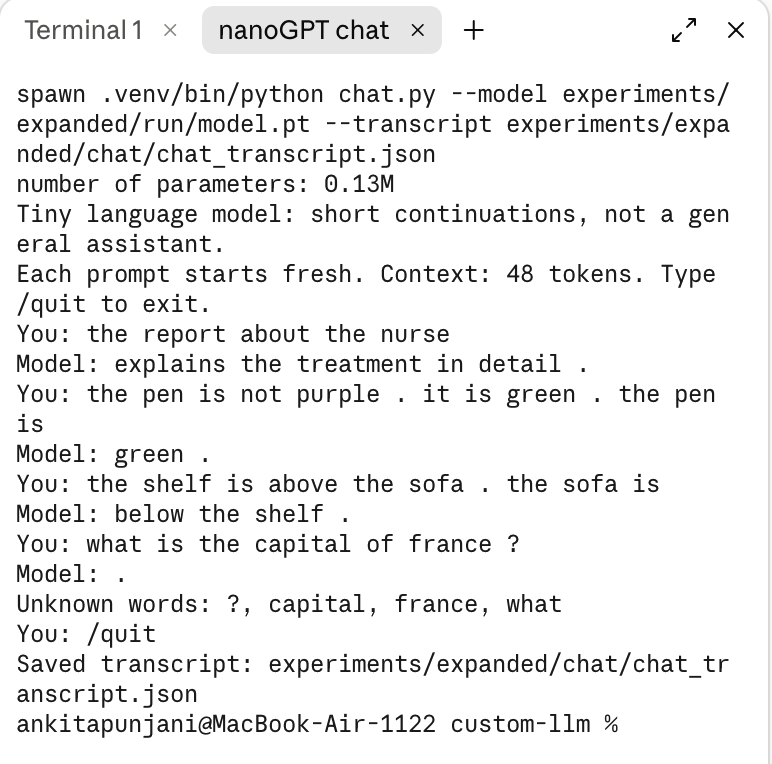

# Building a Custom LLM: nanoGPT on a starter and an expanded corpus

Class 4 assignment, From Zero to AI Agents (Fall 26) · Ankita Punjani

I trained Karpathy's actual nanoGPT transformer ([`nanogpt_model.py`](nanogpt_model.py), unchanged, commit `3adf61e`) from scratch twice. The first run used the supplied classroom corpus. The second used that corpus plus my own teaching text for four eval categories. I ran the fixed 48-case language eval suite before and after training in both experiments, and I chat with the trained model through a terminal interface. This is a **tiny word-level language model**. It continues short sentences from a narrow corpus. It is not a chatbot and does not understand language in general.

The starter code comes from [pepealonso95/custom-llm](https://github.com/pepealonso95/custom-llm). Its original README is kept as [STARTER_README.md](STARTER_README.md) and the assignment text as [ASSIGNMENT.md](ASSIGNMENT.md). I deleted its `examples/` and `legacy/` reference runs so that nobody mistakes them for my results.

## Results at a glance

| Experiment | Stage | Correct / 48 | Scorable / 48 | Accuracy among scorable cases | Full results |
|---|---|---|---|---|---|
| Starter corpus | Untrained | 9 (18.8%) | 24 | 37.5% | [CSV](experiments/starter/run/language_evals/untrained/eval_results.csv) · [JSON](experiments/starter/run/language_evals/untrained/eval_results.json) · [summary](experiments/starter/run/language_evals/untrained/eval_summary.json) |
| Starter corpus | Trained (3,000 steps) | **20 (41.7%)** | 24 | 83.3% | [CSV](experiments/starter/run/language_evals/final/eval_results.csv) · [JSON](experiments/starter/run/language_evals/final/eval_results.json) · [summary](experiments/starter/run/language_evals/final/eval_summary.json) |
| Expanded corpus | Untrained | 8 (16.7%) | 35 | 22.9% | [CSV](experiments/expanded/run/language_evals/untrained/eval_results.csv) · [JSON](experiments/expanded/run/language_evals/untrained/eval_results.json) · [summary](experiments/expanded/run/language_evals/untrained/eval_summary.json) |
| Expanded corpus | Trained (3,000 steps) | **30 (62.5%)** | 35 | 85.7% | [CSV](experiments/expanded/run/language_evals/final/eval_results.csv) · [JSON](experiments/expanded/run/language_evals/final/eval_results.json) · [summary](experiments/expanded/run/language_evals/final/eval_summary.json) |

- **Executed notebooks:** [starter](experiments/starter/custom_llm_starter.executed.ipynb) · [expanded](experiments/expanded/custom_llm_expanded.executed.ipynb) · [10-step smoke test](experiments/smoke_test/custom_llm_smoke10.executed.ipynb)
- **Complete run folders:** [starter](experiments/starter/run/) · [expanded](experiments/expanded/run/). Each folder has also been zipped whole: [starter ZIP](experiments/starter/run.zip) · [expanded ZIP](experiments/expanded/run.zip).
- **Chat evidence:** [transcript](experiments/expanded/chat/chat_transcript.json) · [screenshot](experiments/expanded/chat/chat_screenshot.png) · [terminal log](experiments/expanded/chat/terminal_session.txt)

The honest summary:
- **Extension categories.** The added corpus made 11 of the 12 targeted extension cases scorable (the 12 control cases stayed unscorable). The model gets **grammar 3/3** and **spatial 2/3** reliably. **Opposites (1/3) and negation (0/2)** are fragile.
- **New wording.** 4/8 → 8/8 looks like a gain, but a seed check shows it is mostly seed noise ([below](#is-it-real-a-seed-check)).
- **Limitations.** My probes show that the model learned slot-specific patterns: it copies or inverts words it has seen in that slot before. It did not learn general rules.

---

## 1. Corpus, sources and permissions

| | Experiment 1: starter | Experiment 2: expanded |
|---|---|---|
| Mode | `CORPUS = "classroom"`, empty `corpus/` | `CORPUS = "classroom"` + 4 files in [`corpus/extension/`](corpus/extension/) |
| Source | Synthetic classroom sentences generated in notebook section 3 | The same classroom sentences, plus 1,200 synthetic teaching passages I generated with [`make_extension_corpus.py`](make_extension_corpus.py) |
| Classroom passages withheld because they contain an eval prompt | 160 | 160 |
| Unique passages (after dedup) | 4,592 | 5,792 (1,200 new) |
| Train / validation split | 4,132 / 460 (90/10) | 5,212 / 580 (90/10) |
| Vocabulary (incl. `<UNK>`, `<BOS>`, `<EOS>`) | 136 | 410 |
| Training / held-out unknown-token rate | 0.00% / 0.00% | 0.00% / 0.045% |
| Manifest / vocabulary report | [manifest](experiments/starter/run/corpus_manifest.json) · [vocab](experiments/starter/run/vocabulary_report.json) | [manifest](experiments/expanded/run/corpus_manifest.json) · [vocab](experiments/expanded/run/vocabulary_report.json) |

**Permissions.** Everything is synthetic. The classroom sentences come from the starter's generator. The extension files are my own generated text with no third-party material, so I am free to publish them. They are un-ignored in `.gitignore` for that reason. I used **no PDFs**, so there was no PDF extraction to check. Instead I checked every imported file's passage count and preview in notebook section 3, and read the saved `corpus.txt`. The notebook produced **no extraction warnings** and ignored no files.

**The 0.045% held-out UNK rate** comes from three of my teaching sentences that the random split sent to validation. Their words *visits*, *climbs* and *put* therefore never entered the training vocabulary. Every other word the model needed survived: 407 training types, all kept, well under the 509-type cap.


### Why these four extension categories, and what I added

In experiment 1, all 24 extension cases were unscorable: the words they need never appeared in training. I picked four categories whose gaps could be filled with ordinary words and short, varied sentences, without using the tests' stories or names. I left the other four untaught as **controls**. If the controls stay flat while the targets move, the change comes from the targeted teaching material, not from simply having more data.

| Category (3 eval cases each) | Gap in the starter corpus | What I added (300 passages each, [files](corpus/extension/)) | Example passages |
|---|---|---|---|
| **Grammar** | No *is/are/was/were/am* agreement; no verb tenses; no animals | 12 nouns in singular and plural with a *be*-verb; 12 regular verbs in past / present / *-ing* with 10 subjects; *she* in every tense **except** after *yesterday* (the tested order) | `two frogs are hiding .` · `yesterday they kicked .` · `she is climbing now .` |
| **Opposites** | No adjectives of temperature, amount or sound; no word *opposite* | `the opposite of X is Y` for 15 **untested** pairs; everyday contrast scenes for the tested pairs (hot/cold, full/empty, noisy/quiet) and for 3 bridge pairs that appear in both frames | `the opposite of hard is soft .` · `the market was hot in summer but cold in winter .` |
| **Negation** | No *not*, no correction structure, no colours | Three-sentence correction stories: 14 objects × 10 colours; a past-tense variant; people (a non-eval cast) choosing one thing and not another | `the pen is not blue.it is green.the pen is green.` · `mia did not wear the jacket.she wore the scarf.mia wore the scarf.` |
| **Spatial relations** | No *inside / above / below / beside / left / right / north / south* | Two-sentence inverse relations: inside ↔ contains, above ↔ below, beside ↔ beside, left ↔ right, north ↔ south, with objects **other than** each test's objects in its relation | `the coin is inside the tin.the tin contains the coin.` · `the clock is left of the chair.the chair is to the right of the clock.` |
| Reference, sequence, everyday knowledge, categories/analogies | (same gap) | **Nothing: controls** | – |

Each file samples evenly across its sentence frames, so a large frame can't drown out a small one. Every noun and one-off vocabulary line is always included, so no word needed for scoring is lost to sampling. The generator uses a fixed seed and reruns identically.

## 2. My three choices and prediction

**Corpus:** the starter corpus first, then the same corpus plus my four extension files ([section 1](#why-these-four-extension-categories-and-what-i-added)). Only the data changed between the two experiments. The other two choices were the same both times.

### In my own words

I expected the model to do really well on the 16 starter-pattern tests, since those use the exact sentence shapes it saw thousands of times in training, just with different nouns swapped in. The 8 reworded tests use the same words but in sentence shapes it hasn't seen before, so I expected it to get some right, but not all - it would have to generalize a little instead of just repeating memorized patterns.

For the 24 extension tests (negation, opposites, spatial relations, etc.), I expected close to 0 correct. Not because the model would "think" badly, but because words like *not*, *opposite*, and *below* weren't in its vocabulary at all yet. You can't get a question right using a word you've never seen.

I kept the suggested defaults: **3,000 training steps** and a **learning rate of 0.001**. With my corpus size, 3,000 steps means the model sees the full dataset about 23 times over (3,000 steps × 32 passages ≈ 96,000 passages, and there are 4,132 training passages), enough to learn the repeating templates without me having to guess a bigger number. I didn't raise the learning rate because too big a step size can make training unstable (the loss bounces around instead of going down). I didn't lower it either, because too small a rate would leave the model barely trained after only 3,000 steps.

Before the real runs, a 10-step [smoke test](experiments/smoke_test/) checked that every notebook cell worked (loss 4.93 → 4.21). The notebook also applies a 100-step warmup and cosine decay to the learning rate, so 0.001 is its peak value, not a constant.

**Which version is the "before training" prediction?** The prediction recorded in each executed notebook was written before that experiment trained. It is also saved as [experiments/starter/prediction.md](experiments/starter/prediction.md) and [experiments/expanded/prediction.md](experiments/expanded/prediction.md). The text above is my own explanation of the same expectations, written afterwards. I didn't paste it into the notebooks, so that the before-training record stays exactly as it was.

| I expected… | I observed |
|---|---|
| Loss from ≈ ln(136) = 4.9 to below 1.0, with train ≈ validation | 4.93 → **0.68 train / 0.71 val**. Held-out loss followed training loss, as the shared templates predict |
| Starter patterns mostly pass; new wording partly; extension 0/24 because of missing vocabulary | **16/16**, **4/8**, and **0/24, all 24 unscorable** |
| *customer* moves toward *client / buyer / shopper* | Final cosine neighbours: **shopper 0.978, client 0.977, buyer 0.977** (initially bus, educator, helped at about 0.2) |
| Expanded: 11 of 12 targeted cases scorable, controls still unscorable | **Exactly that.** 35/48 scorable. The only targeted case still unscorable is *ava*, because I used no eval names |
| Expanded: copy/inverse patterns learnable; opposites the hardest | Spatial and grammar yes; opposites were hard as predicted. **Negation failed, which I did not expect.** The cause is explained in [section 5](#what-the-model-actually-learned-probes) |

## 3. The runs

| | Starter | Expanded |
|---|---|---|
| Completed steps | 3,000 of 3,000 (not interrupted) | 3,000 of 3,000 (not interrupted) |
| Training time | 16.2 s | 23.5 s |
| Parameters | 111,872 | 129,408 (a larger vocabulary means more embedding rows) |
| Hardware | Apple M4 MacBook Air, **CPU** (`DEVICE="cpu"`), macOS 15.6.1, Python 3.13.15, PyTorch 2.14.0 | same |
| Config / summary | [config.json](experiments/starter/run/config.json) · [training_summary.json](experiments/starter/run/training_summary.json) · [training.csv](experiments/starter/run/training.csv) | [config.json](experiments/expanded/run/config.json) · [training_summary.json](experiments/expanded/run/training_summary.json) · [training.csv](experiments/expanded/run/training.csv) |

Model (both runs): 2 transformer blocks, 4 attention heads, 64-number embeddings, a 48-token context, and tied input/output embeddings, trained with AdamW (β = 0.9/0.95, weight decay 0.01), seed 42 and batch size 32. There were no failed or interrupted runs. The runs I did besides the two experiments were the 10-step smoke test and the seed check in section 5.

## 4. Evidence from training

### Loss

These are **fixed panels of 20 training and 20 validation passages** (at most 20 documents each). Each value is the mean over every non-padding next-token target in the panel. They are small estimates, not full-corpus losses. Losses from the two corpora are **not directly comparable**, because the vocabularies and data differ.

| Step | Starter train | Starter val | Expanded train | Expanded val |
|---:|---:|---:|---:|---:|
| 0 | 4.9263 | 4.9275 | 6.0182 | 6.0275 |
| 1500 | 0.6821 | 0.7182 | 0.7070 | 0.8451 |
| 3000 | 0.6783 | 0.7061 | 0.6810 | 0.8263 |

Sources: [starter history.json](experiments/starter/run/history.json) · [expanded history.json](experiments/expanded/run/history.json)

| Starter | Expanded |
|---|---|
|  |  |

Both step-0 losses equal ln(vocabulary size): ln 136 = 4.91 and ln 410 = 6.02. At initialization the model spreads its probability almost evenly over every token. Almost all of the learning happens before step 1,500; the second half changes the panel losses by at most 0.026. Loss stays near 0.7 rather than 0, because many slots are genuinely unpredictable. After *"the customer"*, six different verbs are equally correct. The expanded run's validation panel sits higher (0.83 vs 0.68 on its training panel). I checked each passage's loss to find out why. Four of the 20 validation passages are my short teaching sentences, and three of them have the highest per-token losses in the panel: `the opposite of sweet is sour .` (1.90), `yesterday the boy talked .` (1.89) and `right now my friend is talking .` (1.59). In these sentences the adjective, subject or verb is a free choice among many taught words, and a short passage has few easy tokens (like *the* or *.*) to average that out. A 20-passage panel is sensitive to which passages it happens to draw.

### Samples: untrained, halfway, final

All samples use the same settings: temperature 0.8, sampling seed 2026, start token `<BOS>`. Complete files, with nothing omitted:
- starter: [0](experiments/starter/run/samples/step_0000.txt) · [1500](experiments/starter/run/samples/step_1500.txt) · [3000](experiments/starter/run/samples/step_3000.txt)
- expanded: [0](experiments/expanded/run/samples/step_0000.txt) · [1500](experiments/expanded/run/samples/step_1500.txt) · [3000](experiments/expanded/run/samples/step_3000.txt)

| Step | Starter (first 2 of 4 samples) | Expanded (first 2 of 4) |
|---|---|---|
| 0 | `pear professor bond doctor course harvest team physician journey checking buyer … <UNK> taste recommended …`<br>`kitchen purchase journey product question discussion journey service . nurse local` | `near selected talks harvest update wore dim merchandise winter slow sad stool …`<br>`farm weak after sad painted i gray open likes again yesterday … ball frogs <UNK>` |
| 1500 | `our school has a question about the new educator and lesson .`<br>`a review of risk helped us understand the different deposit .` | `today the office focused on data and the local system .`<br>`the new application was mentioned in the security report yesterday .` |
| 3000 | `our school has a question about the new educator and lesson .`<br>`a review of risk helped us understand the different deposit .` | `today the office focused on data and the local system .`<br>`the new application was mentioned in the code report yesterday .` |

**Visible change.** At step 0, the text is a random walk through the vocabulary. The untrained model even emits `<UNK>`, because UNK is just another row it can sample. By step 1,500, every sample is a well-formed classroom template ending in `.`, and the model has learned to stop with `<EOS>`. Between 1,500 and 3,000, the starter samples are almost identical. That matches the flat loss: the model was already fitted.

**Something that didn't change.** At temperature 0.8, the expanded model's samples still all come from the classroom templates, which make up 79% of its data. My extension sentences appear only at higher temperature (next section).

### Temperature: same model, same seed, no weight updates

Source: [starter temperature_comparison.json](experiments/starter/run/temperature_comparison.json) · [expanded temperature_comparison.json](experiments/expanded/run/temperature_comparison.json). The first of 4 samples at each temperature:

| T | Starter | Expanded |
|---|---|---|
| 0.3 | `our school has a question about the new educator and lesson .` | `the important credit was mentioned in the return report yesterday .` |
| 0.8 | `our school has a question about the new educator and lesson .` | `today the office focused on data and the local system .` |
| 1.2 | `our school has a question about the new educator and lesson .` | **`near and sour mean opposite things .`** |

Temperature divides the logits before the softmax: p ∝ exp(logit / T). A low T sharpens the distribution towards the top token; a high T flattens it. No weights change; only sampling changes. The starter model is so confident on its templates that all four samples at T = 0.8 and T = 1.2 are identical. At T = 0.3, one sample swaps a single slot word (*investment* instead of *deposit*), and one becomes a different template sentence (`the local consumer was mentioned in the purchase report yesterday .`). At T = 1.2, the expanded model wandered into my opposites frame and **invented `near and sour mean opposite things .`**. That sentence is not in the corpus; the taught pairs are near/far and sweet/sour. It is a fluent-looking but false recombination: a tiny example of a language model "hallucinating".

### One word, end to end (starter run)

Sources: [tokenization.json](experiments/starter/run/tokenization.json) · [inspection.json](experiments/starter/run/inspection.json) · [checkpoint.json](experiments/starter/run/checkpoint.json)

1. **Text → tokens → IDs.** The first training passage is `today the school focused on lesson and the local professor .` It becomes the IDs `[1, 121, 118, 101, 42, 74, 61, 7, 118, 63, 88, 3, 2]`. `1` is `<BOS>`, `2` is `<EOS>` and `118` is *the*, which appears twice. The IDs are arbitrary row numbers from an alphabetical sort. The model is trained on input → target pairs shifted by one: `<BOS>`→*today*, *today*→*the*, … *professor*→*.*, *.*→`<EOS>`.
2. **ID → vector.** *customer* has ID **28**. Its embedding is row 28 of the 136 × 64 table `wte`. Before training, its first six numbers were `[-0.0576, -0.0048, 0.0426, 0.0193, 0.0156, -0.0288]` (random, std 0.02). After training they are `[0.0366, -0.0182, 0.1330, 0.1060, 0.0630, 0.0189]`. All 64 numbers are listed below and in `inspection.json`. The vector moved by an L2 distance of 0.661. No coordinate has a named meaning. What changed is its **position relative to other words**: its nearest cosine neighbours went from *bus, educator, helped* (≈ 0.2, random) to ***shopper 0.978, client 0.977, buyer 0.977***. Those words fill the same template slots, so training pushed their vectors together. That is distributional learning, not human-style meaning.
3. **One real gradient and update.** At step 0, the loss gradient for `wte[28][0]` was **+0.000693**. A positive gradient means increasing this number would raise the loss. At the first step, the warmup learning rate was 1e-5 (0.001 × 1/100). AdamW's first step is roughly −lr × sign(gradient), because its momentum and variance estimates start from this single gradient, plus a tiny weight-decay term. The observed change was −0.0575919 → **−0.0576019**, a change of −0.00000999, which is almost exactly −lr (weight decay accounts for the tiny difference). So the size of the gradient barely matters for Adam's first step; its sign does.
4. **Probabilities before vs after, for the prefix "the customer".** Before training, the top prediction was *customer* at 1.6%, which is close to uniform (1/136 = 0.7%). After training: ***reviewed* 17.8%, *recommended* 17.1%, *ordered* 16.9%, *selected* 16.3%, *compared* 16.0%**. These are almost exactly 1/6 each. The corpus template is `the {buyer-word} {one of 6 verbs} the {product} after checking the price .`, so the model learned both *which* words can follow and *how evenly* they are spread.
5. **Attention.** For the same prefix, block 1, head 1 gives the *customer* position these weights: **0.485 on `<BOS>`, 0.423 on *the*, 0.092 on itself**. Each position builds its next-token prediction from a weighted mix of the vectors at itself and **earlier** positions only. A causal mask sets future positions to −∞ before the softmax, so a prediction can never peek at the word it is supposed to predict. The expanded model's head instead puts 0.764 on *customer* itself. The same architecture learned a different use for this head.

### The embedding viewer: *customer* before and after training

These are screenshots of the supplied [`embedding-viewer.html`](embedding-viewer.html), unmodified, with each run's `checkpoint.json` loaded through its **Open your checkpoint** button. The images are in [experiments/embedding_viewer/](experiments/embedding_viewer/). I captured them in headless Chrome with [`capture_viewer.sh`](experiments/embedding_viewer/capture_viewer.sh), which feeds the checkpoint through that same file input and regenerates the images exactly.

| Starter: before training (random) | Starter: after 3,000 steps |
|---|---|
|  |  |

| Expanded: after 3,000 steps | Expanded: "Show movement" (start → end of every word) |
|---|---|
|  |  |

What the viewer shows:
- **Before training**, every vector sits in one tight ball near the centre. The initial values are tiny random numbers (std 0.02). *customer*'s "closest" words, *bus* 0.213, *educator* 0.203 and *helped* 0.202, are meaningless coincidences.
- **After training**, the words have spread out. *customer* sits in a tight group with **shopper 0.978, client 0.977 and buyer 0.977** in the starter run, and with **client 0.978, shopper 0.974 and consumer 0.973** in the expanded run. These are the same numbers I computed independently above.
- **Movement lines** connect each word's start and end points. Every word travels outward from the random ball, and *customer* moved a distance of 0.661 (starter) or 0.588 (expanded) in the full 64-number space.
- **The 3D picture is only a partial view.** PCA squeezes 64 dimensions into 3 and keeps only **40.7%** (starter) or **22.9%** (expanded) of the variation. The expanded model's 410 words need more dimensions to separate, so more is lost. Dots that look close in 3D can be far apart in 64D, so the neighbour scores (cosine similarity over all 64 numbers) are the trustworthy measure.

<details><summary><b>Starter run: all 64 numbers of <i>customer</i> (ID 28) before and after training</b></summary>

```text
before: [-0.0576, -0.0048, 0.0426, 0.0193, 0.0156, -0.0288, 0.0256, 0.0001, 0.0247, 0.0207, 0.0074, -0.0331, -0.0535, -0.0057, -0.0242, -0.0147, 0.0047, -0.0105, -0.0084, -0.0183, -0.0201, 0.0051, -0.0109, -0.0126, 0.0284, -0.0026, -0.0041, 0.0136, -0.0099, -0.0167, 0.0019, -0.0015, 0.016, -0.0057, -0.0007, -0.0013, -0.0073, -0.0009, 0.0015, -0.005, -0.029, 0.0181, -0.0073, -0.0054, 0.0156, -0.0045, 0.0416, 0.0524, 0.0226, -0.0154, -0.0251, -0.0068, 0.0294, -0.0025, 0.0298, -0.0228, -0.0302, 0.0064, 0.0505, 0.0075, -0.0107, 0.0247, -0.0145, 0.0132] 
after:  [0.0366, -0.0182, 0.133, 0.106, 0.063, 0.0189, 0.1523, 0.0929, -0.0632, -0.0173, 0.0341, -0.0474, -0.0645, -0.0866, -0.145, -0.0359, -0.1569, -0.1503, -0.0076, -0.0707, -0.093, 0.0091, -0.0648, 0.0175, 0.0039, -0.0625, 0.1125, -0.0643, 0.052, -0.1567, -0.0706, 0.0617, -0.0318, 0.1414, 0.0913, 0.0565, 0.0196, -0.1348, 0.1223, -0.0338, 0.1187, 0.0046, -0.1344, 0.0529, -0.0376, -0.1031, 0.0203, 0.0381, -0.0198, -0.1507, 0.0303, -0.1206, 0.0166, 0.0778, 0.1181, 0.0557, 0.0934, 0.0026, 0.0371, 0.0756, 0.1185, 0.0144, 0.0913, -0.0746] 
```
</details>

<details><summary><b>Expanded run: all 64 numbers of <i>customer</i> (ID 94) before and after training</b></summary>

```text
before: [-0.0377, 0.0028, 0.0178, -0.0093, -0.0067, 0.0349, 0.0047, -0.0031, 0.0182, 0.0213, -0.027, 0.0049, 0.0273, -0.0331, 0.0265, 0.0157, -0.0202, 0.0083, 0.0208, -0.0104, -0.0043, -0.0049, -0.0022, -0.0003, -0.0093, -0.0167, 0.0094, -0.0075, -0.036, -0.014, 0.0142, -0.0156, 0.0153, 0.0053, -0.0283, 0.0111, 0.0145, 0.0053, -0.0058, -0.0259, -0.0516, -0.0053, -0.0143, -0.0127, -0.0047, 0.006, -0.0303, -0.0094, -0.0123, -0.0021, 0.0388, 0.02, 0.0325, -0.0312, 0.0002, 0.0081, 0.0336, -0.0053, -0.0125, 0.0152, -0.0028, -0.0202, 0.031, -0.0051] 
after:  [-0.0194, -0.0302, -0.0017, 0.0518, 0.0325, -0.046, -0.054, -0.149, 0.0732, 0.0259, -0.0036, 0.0318, 0.0905, -0.0672, -0.008, -0.0866, -0.1066, 0.1463, -0.0387, 0.1231, 0.0817, 0.1505, 0.0686, 0.0923, -0.1056, 0.0478, 0.0087, 0.0837, -0.098, -0.0437, 0.0054, 0.0263, -0.0901, -0.07, -0.0619, -0.0165, -0.0104, -0.1044, 0.0014, -0.0026, -0.1709, 0.0464, -0.0776, -0.0227, 0.0537, -0.0545, -0.0476, 0.0257, 0.1147, 0.0603, 0.0108, 0.0484, 0.0947, 0.0236, -0.0371, 0.1177, 0.1647, -0.0919, -0.0525, -0.1415, 0.0269, -0.0772, 0.1057, 0.0233] 
```
</details>


## 5. The 48 fixed language evals

**Suite and runner (unchanged):**
- [`evals/language_evals.json`](evals/language_evals.json) (file SHA-256 `e8affcd7…`) and [`run_evals.py`](run_evals.py). Every `eval_summary.json` also records the suite's content hash, `1d7c503f…`, and it is identical in all four result sets, so all four used exactly the same cases.
- The notebook verifies both hashes at start-up, and would refuse to run if either had been edited.
- The suite is 16 `starter_patterns`, 8 `starter_transfer` (new wording) and 24 `extend_corpus` cases.

**Scoring.** Only the prompt goes into the model, never the choices or the answer key. The runner reads the model's next-token probabilities for the four candidate words. The highest one is the model's answer: 1 if correct, 0 if wrong or tied. If the prompt or any choice contains a word outside the vocabulary, the case is `out_of_vocabulary`. It is not scored, and it counts as 0 in all-case success. Random guessing would average 25%. Separately, the runner saves a free continuation (temperature 0.8, fixed per-case seed, 24 tokens), which is **not** scored.

### Scores by category (correct / scorable / total)

| Group · category | Starter untrained | Starter trained | Expanded untrained | Expanded trained |
|---|---|---|---|---|
| starter · domain_context | 3/8/8 | **8/8/8** | 2/8/8 | **8/8/8** |
| starter · domain_place | 3/8/8 | **8/8/8** | 1/8/8 | **8/8/8** |
| transfer · new_wording | 3/8/8 | 4/8/8 | 2/8/8 | **8/8/8** |
| extend · **grammar** (targeted) | 0/0/3 | 0/0/3 | 1/3/3 | **3/3/3** |
| extend · **opposites** (targeted) | 0/0/3 | 0/0/3 | 1/3/3 | 1/3/3 |
| extend · **negation** (targeted) | 0/0/3 | 0/0/3 | 0/2/3 | 0/2/3 |
| extend · **spatial_relations** (targeted) | 0/0/3 | 0/0/3 | 1/3/3 | **2/3/3** |
| extend · reference (control) | 0/0/3 | 0/0/3 | 0/0/3 | 0/0/3 |
| extend · sequence (control) | 0/0/3 | 0/0/3 | 0/0/3 | 0/0/3 |
| extend · everyday_knowledge (control) | 0/0/3 | 0/0/3 | 0/0/3 | 0/0/3 |
| extend · categories_and_analogies (control) | 0/0/3 | 0/0/3 | 0/0/3 | 0/0/3 |
| **All 48** | **9 / 24 / 48** | **20 / 24 / 48** | **8 / 35 / 48** | **30 / 35 / 48** |
| Coverage | 50.0% | 50.0% | 72.9% | 72.9% |

The untrained rows show how much luck is possible with four choices: 22–38% of scorable cases. Coverage is identical before and after training in each experiment, because it depends only on the vocabulary, which is fixed before training. **More training can never raise coverage. Only new data can.**

<details><summary><b>All 48 cases: trained starter vs trained expanded, with free continuations</b> (click to expand)</summary>

| ID | Category | Prompt | Expected | Starter pick | Starter free text | Expanded pick | Expanded free text |
|---|---|---|---|---|---|---|---|
| lang_01 | domain_context | `the report about the customer explains the` | service | ✅ service | service in detail . | ✅ service | order in detail . |
| lang_02 | domain_context | `the report about the merchandise explains the` | quality | ✅ quality | quality in detail . | ✅ quality | price in detail . |
| lang_03 | domain_context | `the report about the mortgage explains the` | payment | ✅ payment | return in detail . | ✅ payment | return in detail . |
| lang_04 | domain_context | `the report about the mango explains the` | juice | ✅ juice | fruit in detail . | ✅ juice | harvest in detail . |
| lang_05 | domain_context | `the report about the bicycle explains the` | journey | ✅ journey | journey in detail . | ✅ journey | traffic in detail . |
| lang_06 | domain_context | `the report about the application explains the` | security | ✅ security | security in detail . | ✅ security | security in detail . |
| lang_07 | domain_context | `the report about the surgeon explains the` | patient | ✅ patient | treatment in detail . | ✅ patient | care in detail . |
| lang_08 | domain_context | `the report about the tutor explains the` | lesson | ✅ lesson | lesson in detail . | ✅ lesson | student in detail . |
| lang_09 | domain_place | `the team discussed the customer and the service at the` | store | ✅ store | store . | ✅ store | store . |
| lang_10 | domain_place | `the team discussed the merchandise and the quality at the` | market | ✅ market | market . | ✅ market | market . |
| lang_11 | domain_place | `the team discussed the mortgage and the payment at the` | bank | ✅ bank | bank . | ✅ bank | bank . |
| lang_12 | domain_place | `the team discussed the mango and the juice at the` | kitchen | ✅ kitchen | kitchen . | ✅ kitchen | kitchen . |
| lang_13 | domain_place | `the team discussed the bicycle and the journey at the` | station | ✅ station | station . | ✅ station | station . |
| lang_14 | domain_place | `the team discussed the application and the security at the` | office | ✅ office | office . | ✅ office | office . |
| lang_15 | domain_place | `the team discussed the surgeon and the patient at the` | hospital | ✅ hospital | hospital . | ✅ hospital | hospital . |
| lang_16 | domain_place | `the team discussed the tutor and the lesson at the` | school | ✅ school | school . | ✅ school | school . |
| lang_17 | new_wording | `our hospital discussed the nurse and the` | health | ✅ health | health at the hospital . | ✅ health | care at dusk . |
| lang_18 | new_wording | `yesterday the school discussed the educator and the` | student | ❌ harvest | local lecturer . | ✅ student | inside the school . |
| lang_19 | new_wording | `the bank report discussed the bond and the` | return | ❌ care | new investment . | ✅ return | with another loan . |
| lang_20 | new_wording | `our kitchen report discussed the pear and the` | fruit | ✅ fruit | different pear . | ✅ fruit | green . |
| lang_21 | new_wording | `the station report compared the bus and the` | route | ✅ route | important taxi . | ✅ route | important taxi . |
| lang_22 | new_wording | `yesterday our office discussed the platform and the` | update | ❌ treatment | local website . | ✅ update | code . |
| lang_23 | new_wording | `the store report discussed the subscriber and the` | support | ❌ health | important item . | ✅ support | store at beside the school . |
| lang_24 | new_wording | `our market report compared the package and the` | delivery | ✅ delivery | local merchandise . | ✅ delivery | local offering . |
| lang_25 | grammar | `one bird` | is | unscorable | the new customer with another client at the store . | ✅ is | is ready . |
| lang_26 | grammar | `the dogs` | are | unscorable | the new educator with another educator at the school . | ✅ are | are sleeping . |
| lang_27 | grammar | `yesterday she` | walked | unscorable | the new buyer with another client at the store . | ✅ walked | cooked . |
| lang_28 | opposites | `the opposite of hot is` | cold | unscorable | [empty] | ❌ warm | cool . |
| lang_29 | opposites | `the opposite of empty is` | full | unscorable | [empty] | ✅ full | clean . |
| lang_30 | opposites | `the opposite of noisy is` | quiet | unscorable | [empty] | ❌ late | round . |
| lang_31 | negation | `the box is not red . it is blue . the box is` | blue | unscorable | [empty] | ❌ red | application . |
| lang_32 | negation | `ava did not buy tea . she bought milk . ava bought` | milk | unscorable | [empty] | unscorable | . she ordered the pear . |
| lang_33 | negation | `the door is not open . it is closed . the door is` | closed | unscorable | [empty] | ❌ open | rich . |
| lang_34 | reference | `maya lent a book to leo . leo thanked` | maya | unscorable | the station . | unscorable | . |
| lang_35 | reference | `ella gave finn a pencil . the person who received the pencil was` | finn | unscorable | mentioned in the different mango yesterday . | unscorable | deposit . |
| lang_36 | reference | `omar called nina . nina answered the call from` | omar | unscorable | the bank . | unscorable | the market . |
| lang_37 | sequence | `first wash the cup . then dry it . the last action is` | dry | unscorable | [empty] | unscorable | inside the buyer . |
| lang_38 | sequence | `lunch happens after breakfast . the earlier meal is` | breakfast | unscorable | [empty] | unscorable | inside it . |
| lang_39 | sequence | `the train arrived before the bus . the vehicle that arrived later was the` | bus | unscorable | new bicycle focused on journey report yesterday . | unscorable | ready . |
| lang_40 | spatial_relations | `the book is inside the bag . the bag contains the` | book | unscorable | new loan report yesterday . | ✅ book | letter . |
| lang_41 | spatial_relations | `the lamp is above the desk . the desk is` | below | unscorable | [empty] | ✅ below | below the sock . |
| lang_42 | spatial_relations | `the ball is left of the box . the box is to the` | right | unscorable | new banana focused on harvest at the different peach focused on fruit . | ❌ left | right of the truck . |
| lang_43 | everyday_knowledge | `water freezes into` | ice | unscorable | the new program focused on data and security . | unscorable | the hall . |
| lang_44 | everyday_knowledge | `a person uses an umbrella to stay` | dry | unscorable | [empty] | unscorable | . |
| lang_45 | everyday_knowledge | `to see in a dark room we turn on a` | light | unscorable | kitchen . | unscorable | discussion of traffic . |
| lang_46 | categories_and_analogies | `a robin is a bird . a salmon is a` | fish | unscorable | office . | unscorable | not of travel . |
| lang_47 | categories_and_analogies | `a puppy grows into a dog . a kitten grows into a` | cat | unscorable | bank station focused on traffic helped us understand the different bicycle focused on traffic helped us understand the journey . | unscorable | baker is river . |
| lang_48 | categories_and_analogies | `a carrot is a vegetable . an apple is a` | fruit | unscorable | kitchen . | unscorable | soup . |

The untrained picks and continuations for both experiments are in the linked untrained CSV/JSON files.
</details>


### Where the improvement came from: vocabulary, patterns, or both?

- **Starter patterns (16/16 in both):** learned patterns. These are the classroom templates with the exact prefixes withheld, so the model sees the same sentence frame with other nouns. The free continuations show it: `the report about the customer explains the` → *service in detail .*, and `the team discussed the mango and the juice at the` → *kitchen .*
- **New wording (starter 4/8):** a partly learned pattern. The model overfits to templates. For `yesterday the school discussed the educator and the` it picks *harvest*, not *student*. Its free continuation is `local lecturer .`: it treats the slot as another noun of the same kind, because in the templates *"and the"* is usually followed by a context word from the **same** sentence type. Passes like `our hospital discussed the nurse and the` → *health* work because *nurse* and *health* co-occur heavily.
- **Extension, starter run (0/24):** pure vocabulary. Every case contained a word the model had never seen, such as *not*, *opposite* or *below*, so it could not be scored. This is the clearest demonstration of *"more training on the original corpus cannot supply missing vocabulary"*.
- **Extension, expanded run (0 → 6 correct):** **both.**
  - **Vocabulary:** 11 targeted cases became scorable, but the untrained expanded model already got 3 of them right by luck.
  - **Learned patterns:** training added 3 more wins, and the probability margins are large, not lucky:

  | Case | Correct choice | Next-best choice | Free continuation |
  |---|---|---|---|
  | `one bird` | *is* 0.975 | *are* 0.002 | `is ready .` |
  | `the dogs` | *are* 0.967 | *is* 0.001 | `are sleeping .` |
  | `the lamp is above the desk . the desk is` | *below* 0.941 | *inside* 0.026 | `below the sock .` |

  None of these exact phrases was taught. *one bird*, *the dogs*, *yesterday she* and lamp/desk in a vertical relation were deliberately kept out of the corpus. So the model generalized the pattern to new fillers.
- **Controls (0 → 0, all unscorable):** the four untaught categories gained nothing, as intended. Any change in the targeted categories comes from the targeted teaching material, not from simply training on more data.

### Failures, with actual outputs (expanded, trained)

| Case | Picked (prob) | Correct (prob) | Free continuation | Why (see probes below) |
|---|---|---|---|---|
| `the opposite of hot is` | warm (0.080) | cold (0.006) | `cool .` | Hot/cold was taught only in contrast sentences. The model answers "opposite of" with a word from that frame's own vocabulary, here the warm/cool pair |
| `the opposite of noisy is` | late (0.035) | quiet (0.016) | `round .` | Same cause |
| `the opposite of empty is` ✓ | full (0.059) | – | `clean .` | Correct, but with a small margin: likely partly luck |
| `the box is not red . it is blue . the box is` | red (0.005) | blue (0.002) | `application .` | *blue* never appeared as the corrected colour in my stories |
| `the door is not open . it is closed . the door is` | open (0.007) | closed (0.003) | `rich .` | open/closed never appeared in a negation story |
| `the ball is left of the box . the box is to the` | left (0.394) | right (0.024) | `right of the truck .` | The inversion only works reliably for objects that appeared in that frame |
| `ava did not buy tea . she bought milk . ava bought` | unscorable | – | `. she ordered the pear .` | *ava*, *tea*, *milk* etc. are not in the vocabulary, by my choice |

The left/right case is a good illustration of **the four-choice score and the free text measuring different things**. The scored choice is wrong (*left* 0.394). But the sampled continuation happened to be `right of the truck .`, because sampling at T = 0.8 sometimes picks a lower-probability token. Neither result alone tells the full story.

### What the model actually learned: probes

To separate "pattern not learned" from "pattern tied to familiar words", I probed the expanded model with **my own prompts, not eval cases**. The probes are inference only: [`experiments/analysis/probe_patterns.py`](experiments/analysis/probe_patterns.py) → [`probe_results.json`](experiments/analysis/probe_results.json).

| Probe | Top prediction |
|---|---|
| `the kite is not green . it is pink . the kite is` (familiar object, colours) | **pink 0.915** |
| `the crate is not green . it is pink . the crate is` (object never in a negation story) | **pink 0.896** |
| `the kite is not green . it is blue . the kite is` (*blue* never in the corrected slot) | white 0.319, blue only 0.111 |
| `the gate is not closed . it is open . the gate is` (open/closed never in the stories) | inside 0.336 |
| `the sofa is left of the piano . the piano is to the` (familiar objects) | **right 0.932** |
| `the key is left of the jar . the jar is to the` (objects never in this frame) | right 0.497, south 0.202 |
| `the opposite of big is` (pair taught in this frame) | **small 0.53** |
| `the opposite of full is` (pair taught only in contrasts) | cool 0.399, empty 0.106 |

**Conclusion:** the model did learn the correction and inversion patterns, and they carry over to new *objects*. But they do **not** carry over to a new *answer word*. It copies colours it has seen in the corrected slot, not "whatever word follows *it is*". It also didn't combine two kinds of sentence: it never linked "hot and cold contrast in scenes" with "the opposite of X is Y". Ironically, the negation gap was created by my leakage precautions. So that no 5-word run would match a test, I never used *red* as the denied colour, never used *blue* as the corrected colour, and left *open*/*closed* out of the negation stories entirely. Those were exactly the fillers the tests needed.

### Is it real? A seed check

A single seed can't separate a real change from luck, so I retrained both corpora with seeds 1, 2 and 3. [`experiments/analysis/seed_check.py`](experiments/analysis/seed_check.py) runs the unmodified `custom_llm.py` with only `SEED` changed; that also changes the split and the batches. Results: [seed_check_summary.json](experiments/analysis/seed_check/seed_check_summary.json).

| Correct (seeds 42 / 1 / 2 / 3) | Starter corpus | Expanded corpus |
|---|---|---|
| starter_patterns /16 | 16 / 16 / 16 / 16 | 16 / 16 / 16 / 16 |
| starter_transfer /8 | 4 / 6 / 7 / 7 | 8 / 7 / 8 / 6 |
| extend_corpus /24 | 0 / 0 / 0 / 0 | 6 / 9 / 7 / 9 |
| grammar · opposites · negation · spatial | – | 3·1·0·2 / 3·3·1·2 / 3·1·1·2 / 3·2·2·2 |
| **total /48** | **20 / 22 / 23 / 23** | **30 / 32 / 31 / 31** |

- **Real:** the extension gain (0 → 6–9 under every seed), grammar 3/3 and spatial 2/3 every time.
- **Noise:** the new-wording jump. Seed 42's starter run (4/8) was simply its worst seed, and the ranges overlap (4–7 vs 6–8). I don't credit my corpus for it.
- **Fragile:** opposites (1–3) and negation (0–2) swing with the seed, which fits the probes.
- **Coverage luck:** in seed 2, *door* ended up only in validation and dropped out of the vocabulary, so the door case became unscorable. My corpus has only one sentence containing *door*, and only one containing *book*.

### Keeping the exam out of the textbook

- **The notebook's own checks** ([starter](experiments/starter/run/eval_separation.json) · [expanded](experiments/expanded/run/eval_separation.json) `eval_separation.json`):
  - It withheld the 160 classroom sentences that contained an eval prompt, before the split and before building the vocabulary.
  - It would have rejected any imported passage containing an exact prompt.
  - It refuses a corpus folder that contains `evals/`.
  - `CORPUS_FOLDER` stayed `corpus/`.
- **My stricter check** ([`check_leakage.py`](check_leakage.py) → [leakage_check.json](experiments/expanded/leakage_check.json)) tested all 1,200 imported passages for four things. It found **0 exact prompt matches**, **0 shared runs of 5+ consecutive tokens** with any eval prompt *or explanation*, **0 passages containing all four choices of a case**, and **0 eval names**. At 4 tokens, the only overlap is the phrase `is left of the`: the relation being taught, not a test item.
- **How I wrote the corpus:**
  - [`make_extension_corpus.py`](make_extension_corpus.py) never opens `evals/`.
  - It uses a different cast of names (mia, sam, zoe…).
  - It never places a test's objects in the relation that test asks about: no book-in-bag, lamp-above-desk, ball-left-of-box or box/door negation, and never the phrases *one bird*, *the dogs* or *yesterday she*.
  - It keeps tested opposite pairs out of the `the opposite of … is` frame.
  - It avoids content words from the four control categories. Two words overlap unavoidably: *book* (needed for spatial) and *bird* (needed for grammar) also appear in one control case each, and both of those cases remain unscorable.
- **Nothing else entered training:** no eval outputs, chat transcripts or README text went into `corpus/`.
- **The limits:** exact-match and n-gram checks can't detect paraphrases or semantic overlap. I also looked at the eval categories while writing the teaching material, and re-inspected results afterwards. So this is a **public development benchmark**, not an unseen test of generalization. A generalization claim would need fresh tests that never guided my choices.

**Why multi-sentence stories have no space after internal periods.** The notebook splits passages at every `.` followed by whitespace. Written normally, `The kite is not green. It is pink.` would become two separate one-sentence passages, and the model would never see a correction inside one context. Writing `the kite is not green.it is pink.the kite is pink.` keeps the story in one passage. It tokenizes to exactly the same tokens as `green . it`, which you can check in [corpus.txt](experiments/expanded/run/corpus.txt).


### What stayed fixed, what training changed, what changed only at inference

- **Fixed across all four result sets:**
  - the nanoGPT architecture (2 blocks, 4 heads, 64-dimensional embeddings, 48-token context);
  - seed 42, batch size 32, 3,000 steps, learning rate 0.001 with warmup and cosine decay;
  - the 90/10 passage split within each experiment, and the fixed 20 + 20 loss panels;
  - the sample settings (T = 0.8, seed 2026);
  - the 48 eval cases, their choices, answer key and scoring, and the eval sampling settings (T = 0.8, seed 2026 + case index, 24 tokens).
- **Changed between experiments:** only the data. Experiment 2 adds `corpus/extension/`. That changes the vocabulary (136 → 410), the number of embedding rows (111,872 → 129,408 parameters), the random initial weights and the split. This is why losses across the two corpora aren't directly comparable.
- **Changed by training (untrained → trained within one experiment):** only the weights: every embedding row, attention projection, MLP and LayerNorm parameter. The vocabulary, and therefore eval coverage, was fixed *before* training. That is why coverage is identical in the untrained and trained rows.
- **Changed only at inference, with no weight updates:** the temperature (0.3 / 0.8 / 1.2), the sampling seed, the chat prompts, and the prompts the eval runner feeds in. `run_evals.py` hashes the model before and after evaluating and raises an error if any weight changed.

## 6. Chat interface

The interface is [`chat.py`](chat.py), the supplied terminal loop, unchanged. It loads `model.pt` together with its saved vocabulary, and each prompt starts fresh, with no conversation memory. Every reply is generated by my trained nanoGPT at temperature 0.8, with at most 24 tokens and seed 2026 + turn number. The script prints unknown words and warns when a prompt is longer than the 48-token context. It never trains on the chat, and nothing it produces goes into `corpus/`.

**Model used:** the expanded-corpus run, [`experiments/expanded/run/model.pt`](experiments/expanded/run/model.pt), 3,000 steps. Its weights have SHA-256 `aafa9d5a…`, recorded in the transcript.



Transcript: [chat_transcript.json](experiments/expanded/chat/chat_transcript.json). Four real interactions:

| You | Model | Note |
|---|---|---|
| `the report about the nurse` | `explains the treatment in detail .` | Continues a classroom template |
| `the pen is not purple . it is green . the pen is` | `green .` | The negation pattern, with familiar colours |
| `the shelf is above the sofa . the sofa is` | `below the shelf .` | The inverse relation, and it even names the right object |
| `what is the capital of france ?` | `.` (unknown words: `?`, capital, france, what) | **Failure/limitation**: it isn't a question answerer. It has never seen these words, so it sees `<UNK> is the <UNK> of <UNK> <UNK>` and just ends the sentence |

The prompts were typed into the live, interactive `chat.py` by [`chat_demo.exp`](experiments/expanded/chat/chat_demo.exp), a small `expect` script, so the session can be replayed exactly. The replies are the model's real output ([terminal log](experiments/expanded/chat/terminal_session.txt)). The notebook's section 10 chat cell also ran once in each executed notebook, and its transcript is in each run folder as `chat_transcript.json`.

## 7. Reproduce everything

Requirements: Python 3.10+ (I used 3.13), plus `torch`, `pypdf`, `numpy`, and `jupyter`/`nbconvert` for the notebooks. CPU is enough; no API keys or pretrained weights are needed.

```bash
python3 -m venv .venv
.venv/bin/pip install -r requirements.txt numpy nbconvert
```

**Chat with the saved model** (type `/quit` to exit; use a new transcript name each time):

```bash
.venv/bin/python chat.py --model experiments/expanded/run/model.pt --transcript results/my-chat.json
```

**Rerun the 48 evals on saved weights.** These use inference only and write to a fresh folder. Use the same commands with `experiments/starter/run/...` for the starter experiment.

```bash
.venv/bin/python run_evals.py --model experiments/expanded/run/model.pt --output results/expanded-final
```

```bash
.venv/bin/python run_evals.py --model experiments/expanded/run/model_untrained.pt --stage untrained --output results/expanded-untrained
```

Rerunning reproduces the saved scores exactly, and the model hashes match those in the saved summaries.

**Retrain both experiments from scratch.** [`run_notebook.py`](run_notebook.py) copies the starter notebook, sets section 1 and the prediction, then runs all cells. Experiment 1 must run with the extension files moved out of `corpus/`:

```bash
T=$(mktemp -d) && mv corpus/extension "$T/" && .venv/bin/python run_notebook.py --steps 3000 --prediction experiments/starter/prediction.md --output results/starter.ipynb; mv "$T/extension" corpus/
```

```bash
.venv/bin/python make_extension_corpus.py && .venv/bin/python check_leakage.py --output results/leakage.json && .venv/bin/python run_notebook.py --steps 3000 --prediction experiments/expanded/prediction.md --output results/expanded.ipynb
```

Each run writes a new timestamped folder in `llm_runs/`, which is git-ignored. I moved mine to `experiments/`. The notebook also still opens in Colab or Jupyter: set section 1 and Run All. To view embeddings, open [`embedding-viewer.html`](embedding-viewer.html), choose **Open your checkpoint**, and load either run's `checkpoint.json`. To regenerate the screenshots, run `zsh experiments/embedding_viewer/capture_viewer.sh` (needs Google Chrome and `pip install pillow`).

## 8. What I learned

### Following one word from text to a learned vector

A computer can't read words directly, so every word first gets turned into a number. "Customer" became **token ID 28**, just a label, like a locker number ([tokenization.json](experiments/starter/run/tokenization.json)). That ID points to row 28 in a big table, and that row holds **64 numbers** (called an embedding). These numbers start out completely random ([all 64, before and after](#the-embedding-viewer-customer-before-and-after-training)).

During training, every time "customer" showed up in a sentence, those 64 numbers got nudged slightly, depending on whether the model's guess was right or wrong. Because "customer," "shopper," "client," and "buyer" all show up in the exact same spots in my sentences, the model nudged their numbers in similar directions, not because it understands they mean similar things, just because it noticed they're swapped in and out of the same slots.

By the end, those four words' vectors were almost identical: about **0.98 cosine similarity** (a way of measuring how "close" two vectors point, where 1.0 means identical direction and 0 means unrelated), up from about 0.2 before training. You can see this in the [embedding viewer screenshots](#the-embedding-viewer-customer-before-and-after-training). The honest conclusion: the model didn't learn what a customer is. It only learned that these four words get used the same way in this data. That's a pattern, not real understanding.

### How the loss, gradient, and weight update actually worked

**Loss** is a number that measures how surprised the model is by the real next word. High loss means it didn't see that word coming. It started at **4.93**, which is basically what you'd get from guessing randomly among the model's 136 known words. Training brought it down to **0.68** ([history.json](experiments/starter/run/history.json), [loss table](#loss)). It never hits zero, and that's fine and expected: after "the customer," several different verbs could correctly come next, so some uncertainty is baked into the task itself. The trained model gives five of them about 16–18% each.

The **gradient** is the signal that tells each number which direction to move to make the loss smaller. For the first number in "customer"'s vector, the gradient was **+0.000693**, a small push saying "move down a bit" ([inspection.json](experiments/starter/run/inspection.json), `first_update`).

The **optimizer** (called AdamW) is what actually makes that move happen. It shifted that number from **−0.0575919 to −0.0576019**, a step almost exactly the size of the learning rate at that moment: 0.00001, much smaller than the target 0.001, because training was still "warming up", a phase where the learning rate ramps up slowly instead of starting at full strength. One extra detail worth mentioning: on AdamW's very first update, the direction of the gradient matters more than its exact size, since the optimizer hasn't built up a sense yet of how big a step to take.

That's the whole mechanism, just repeated an enormous number of times: tiny nudges like this, across **111,872 numbers** in the model, 3,000 times over. There's no separate "understanding" step. Learning here just is this repeated small-scale adjusting.

### Why the negation test failed - and what the model actually learned instead

The model did pick up a version of the negation pattern, just a narrower one than I hoped for. Given "the kite is not green. it is pink. the kite is," it correctly answers "pink" with **92% confidence**. It still answers "pink" with 90% confidence for an object it never saw in any negation story ("the crate is not green…"). See [probe_results.json](experiments/analysis/probe_results.json) and [the probe table](#what-the-model-actually-learned-probes).

But when the correct answer was "blue" instead, it failed (only 11%), because in my training stories, "blue" never showed up in that "corrected color" spot. That's the key finding: the model didn't learn the actual rule, "repeat whatever word comes right after 'it is.'" It learned something much narrower: "repeat one of the specific colors I've seen used in this exact spot before." Blue was never in that spot, so it had no way to produce it there, no matter how well it seemed to handle negation with pink.

The funny part is I caused this gap myself. So that no training sentence would copy a test question, I never used "red" as the color being denied, never used "blue" as the corrected color, and left "open"/"closed" out of the negation stories entirely. That is exactly the kind of precaution the assignment asks for. But those were exactly the words the tests needed to see in those spots. The lesson: being careful about leakage can accidentally hide the evidence you'd need to show that the model generalized instead of just memorized.

### The corpus, attention, and temperature

**Corpus and held-out data.** The corpus is literally everything the model knows. It has no other source of information, so if a word or pattern isn't in the training text, the model can't learn it. That's why the starter model couldn't touch the extension tests. I held out 10% of the passages ([split.json](experiments/starter/run/split.json)) so I could check whether the model does well on sentences it never trained on, not just the ones it memorized. The catch is that those held-out sentences use the same templates as the training ones. So the low validation loss (0.71) only shows the model learned the templates well, not that it can handle language in general.

**Attention.** When the model predicts the next word, attention lets it look back at the earlier words in the sentence and decide how much each one matters. It can only look backwards: a "causal mask" blocks every future word, so it can't cheat by peeking at the answer. You can see this working in `the lamp is above the desk . the desk is`: the model reaches back six words to *above* and predicts *below* with 94% confidence ([results](experiments/expanded/run/language_evals/final/eval_results.json)).

**Probabilities to words, and temperature.** At every step, the model gives each word in its vocabulary a probability of coming next. To generate text, it picks one word based on those probabilities, adds it to the sentence, and repeats until it predicts the end of the passage. Temperature changes how it picks. A low temperature makes it stick to its most likely guess, and a high temperature spreads the chances out, so less likely words get picked more often. Temperature doesn't change any weights, only how the model samples from what it already learned. In my runs, low temperature kept repeating the same safe template, and at 1.2 the model made up `near and sour mean opposite things .`, a sentence that isn't in the corpus and isn't even true ([temperature_comparison.json](experiments/expanded/run/temperature_comparison.json)).

## 9. One limitation and my next experiment

The biggest surprise here wasn't about the model, it was about how easy it is to misread a score. My expanded-corpus model scored **8/8** on the reworded tests, compared to **4/8** for the starter model, which looked like clear proof that my new training data helped. But when I reran the starter model with three different random seeds (basically, three different random starting points), it scored **6 to 7 out of 8** on its own, with no new data at all ([seed check](#is-it-real-a-seed-check), [seed_check_summary.json](experiments/analysis/seed_check/seed_check_summary.json)). That means most of the improvement I saw was just luck from how that one training run happened to go, not a real effect of my new corpus. Checking across multiple seeds instead of trusting one lucky run is what makes a result actually trustworthy.

**The real limitation** this shows: the model's "rules" are tied to the exact words and sentence spots it has seen before. It can look like it learned a general idea from one example, then fail on an almost identical case that just swaps in an unfamiliar word, exactly what happened with pink versus blue. The same limit shows up in chat: `what is the capital of france ?` gets just `.`, because four of its words are unknown ([chat](#6-chat-interface)).

**My next experiment:** I'd rewrite the teaching stories so every color and state (not just the common ones) shows up in every sentence position, and I'd make rare words like "door" and "book" appear more often so they're not undertrained. Right now each appears in only one passage, and in one seed *door* ended up only in validation and dropped out of the vocabulary. I'd expect that to make negation and opposites work consistently across different random seeds instead of swinging based on luck. To really test for generalization, rather than a fancier kind of memorization, I'd also write a brand new set of test questions that I never look at while writing the training text, so my choices couldn't accidentally be shaped by what I already know the test checks for.

## Repository map

```text
custom_llm.ipynb / custom_llm.py    starter notebook (unexecuted source) and its script form
nanogpt_model.py                    Karpathy's nanoGPT model.py, unchanged (MIT, NANOGPT_LICENSE)
run_evals.py, evals/                fixed eval runner and 48-case suite, unchanged
chat.py                             terminal chat interface, unchanged
run_notebook.py                     mine: executes a copy of the notebook with my settings
make_extension_corpus.py            mine: generates corpus/extension/*.txt
check_leakage.py                    mine: stricter eval-separation check
corpus/extension/                   my 1,200 teaching passages (4 files)
experiments/smoke_test/             10-step setup run
experiments/starter/                experiment 1: prediction, executed notebook, run folder + ZIP
experiments/expanded/               experiment 2: same, plus leakage report and chat evidence
experiments/analysis/               probes and seed check
experiments/embedding_viewer/       viewer screenshots for both runs + the script that captures them
```
